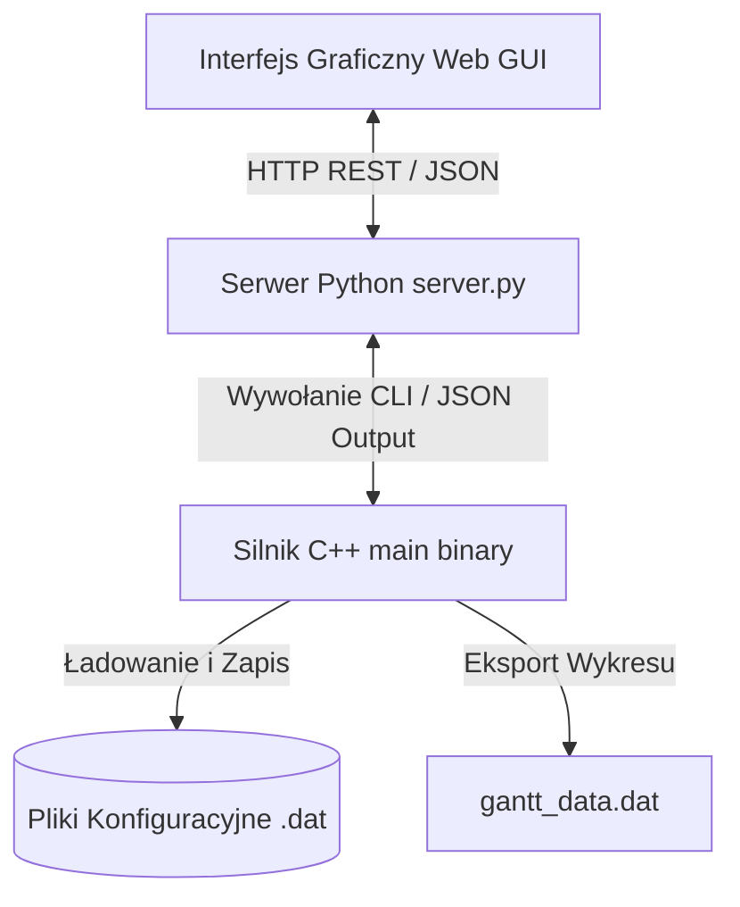

# Dokładna Dokumentacja Techniczna i Użytkowa — Embedded Resource Simulator

Symulator Zasobów Wbudowanych (Embedded Resource Simulator) to zaawansowane środowisko C++17 wraz z interaktywnym interfejsem graficznym (Web GUI) przeznaczone do modelowania, analizy i optymalizacji szeregowania grafów zadań w złożonych systemach wbudowanych o ograniczonych zasobach sprzętowych.

---

## 1. Architektura Systemu

System składa się z trzech głównych warstw:
1. **Silnik Analityczno-Symulacyjny C++17**:
   - Realizuje operacje na grafach zadań (DAG), wyznaczanie ścieżek krytycznych, algorytmy szeregowania oraz rafinacji z funkcją kary.
   - Zapewnia eksport wyników do formatów `.dat`, `gantt_data.dat` oraz **JSON**.
2. **Serwer Udostępniania API (Python REST Server `server.py`)**:
   - Lekki serwer pośredniczący między interfejsem użytkownika a binarką C++.
   - Zapewnia punkty końcowe REST API (`/api/run-simulation`, `/api/benchmark`, `/api/files`, `/api/file-content`, `/api/save-file`).
3. **Nowoczesny Interfejs Graficzny (Web GUI)**:
   - Zbudowany w estetyce Glassmorphic z wykorzystaniem HTML5, Vanilla CSS i JavaScript.
   - Oferuje interaktywny wykres Gantta, wizualizację grafu skierowanego (DAG), panel benchmarkingowy oraz edytor plików.



---

## 2. Podstawy Matematyczne i Algorytmiczne

### 2.1. Model Grafu Zadań i Sprzętu
System modeluje aplikację jako skierowany graf acykliczny (DAG):
$$G = (V, E)$$
gdzie:
- $V = \{T_0, T_1, \dots, T_{n-1}\}$ oznacza zbiór zadań.
- $E \subseteq V \times V$ reprezentuje zależności kolejnościowe i przepływ danych między zadaniami.

Sprzęt składa się ze zbioru jednostek wykonawczych:
$$H = \{H_0, H_1, \dots, H_{m-1}\}$$
dzielących się na:
- **Hardware Cores (HC)**: Sprzętowe rdzenie dedykowane.
- **Processing Elements (PE)**: Ogólne jednostki przetwarzania.

### 2.2. Macierze Czasu i Kosztu
Dla każdego zadania $T_i \in V$ oraz jednostki sprzętowej $H_j \in H$ zdefiniowane są wartości:
- $t(T_i, H_j)$: czas wykonania zadania $T_i$ na sprzęcie $H_j$.
- $c(T_i, H_j)$: koszt wykonania zadania $T_i$ na sprzęcie $H_j$.

### 2.3. Algorytmy Szeregowania (Strategie)

1. **Strategia 1 (S1 — Najszybsza Dedykowana / Min-Time Dedicated)**:
   Tworzy dedykowaną instancję sprzętową dla każdego zadania, wybierając jednostkę o najkrótszym czasie wykonania $t(T_i, H_j)$.
2. **Strategia 2 (S2 — Najtańsza Dedykowana / Min-Cost Dedicated)**:
   Wybiera jednostkę sprzętową o najmniejszym koszcie wykonania $c(T_i, H_j)$ dla każdego zadania na osobnej instancji.
3. **Strategia 3 (S3 — Najszybsza z Upakowywaniem Instancji / Min-Time Instance Reuse)**:
   Szereguje zadania na najszybszym sprzęcie, preferując ponowne wykorzystywanie wolnych instancji tego samego typu.
4. **Strategia 5 (S5 — Poziomowa BFS / BFS Level-Order Scheduling)**:
   Przechodzi graf metodą przeszukiwania w szerokość (BFS) i dokonuje alokacji zadań na wolne instancje sprzętowe w oparciu o czas zakończenia wcześniejszych zadań.
5. **Strategia 6 (S6 — Zachłanna Ścieżki Krytycznej / Critical-Path Greedy)**:
   Priorytetyzuje gałęzie grafu o najdłuższym szacowanym czasie wykonania ścieżek wyjściowych.
6. **Strategia 7 (S7 — Hybrydowa z Dwuetapową Rafinacją / Two-Phase Refined)**:
   Generuje wstępną alokację najszybszą (Strategia 1), a następnie uruchamia dwuetapowy algorytm rafinacyjny przesuwający zadania.
7. **Strategia 8 (S8 — Optymalizacja Kosztowo-Czasowa z Funkcją Kary / Constrained Penalty Optimization)**:
   Algorytm iteracyjnej optymalizacji kosztowo-czasowej. Rozpoczyna od najszybszego podziału, identyfikuje ścieżki krytyczne i przemieszcza zadania na tańsze instancje. Stosuje funkcję kary w przypadku przekroczenia dyrektywy czasowej $T_{\text{hard}}$:
   $$\text{TotalCost} = \sum_{\text{inst}} \text{Cost}_{\text{HW}} + \sum_{T_i} c(T_i, H_{\text{inst}}) + \max(0, T_{\text{critical}} - T_{\text{hard}}) \times P$$
   gdzie $P = 2$ oznacza współczynnik kary (PUNISHMENT).
8. **Strategia 9 (S9 — Monolityczna Jednoprocesorowa / Single Core Baseline)**:
   Punkt odniesienia stanowiący monolityczny przydział wszystkich zadań sekwencyjnie na pojedynczą jednostkę przetwarzania.

### 2.4. Weryfikacja Warunkowa Zadań
Dla zadań oznaczonych jako warunkowe ($C T_i$) system ewaluuje reguły w czasie rzeczywistym. Jeśli warunek (np. `CRITICAL_TIME > 200` lub `DONE[T0] == 100`) nie jest spełniony, zadanie $T_i$ oraz zależne gałęzie są automatycznie pomijane.

---

## 3. Układ Katalogów i Dokumentacja Klas C++

Projekt został ustrukturyzowany w modułowej architekturze katalogowej:

```text
/
├── main.cpp
├── Makefile
├── server.py
├── run_gui.sh
│
├── src/
│   ├── models/                   # Klasy domeny, grafów i zasobów sprzętowych
│   │   ├── TaskGraph.h / .cpp
│   │   ├── HardwareProcessor.h / .cpp
│   │   ├── HardwareInstance.h / .cpp
│   │   ├── CommunicationBus.h / .cpp
│   │   ├── ExecutionMatrix.h / .cpp
│   │   ├── SubTaskManager.h / .cpp
│   │   ├── Edge.h / .cpp
│   │   ├── ConfigParser.h / .cpp
│   │   └── TimeAndCost.h
│   │
│   └── simulator/                # Moduły silnika TaskSchedulerSimulator
│       ├── TaskSchedulerSimulator.h / .cpp
│       ├── SimulatorCreating.cpp
│       ├── SimulatorGetters.cpp
│       ├── SimulatorNormalizing.cpp
│       ├── SimulatorPrinting.cpp
│       ├── SimulatorRefining.cpp
│       ├── SimulatorScheduler.cpp
│       └── SimulatorSubtasks.cpp
```

| Nowa Nazwa Klasy | Dotychczasowy Alias | Ścieżka Pliku | Rola i Podział Odpowiedzialności w Systemie |
| :--- | :--- | :--- | :--- |
| **`TaskSchedulerSimulator`** | `Cost_List` | `src/simulator/TaskSchedulerSimulator.h` | Główny silnik i kontroler symulatora. Zarządza cyklem życia symulacji, grafem zadań, instancjami sprzętowymi, algorytmami szeregowania, rafinacją oraz eksportem wyników (JSON, Gantt). |
| **`TaskGraph`** | `Graf` | `src/models/TaskGraph.h` | Dedykowana struktura danych grafu skierowanego (DAG) z listą sąsiedztwa. Realizuje alokację krawędzi oraz przeszukiwania BFS i DFS. |
| **`HardwareProcessor`** | `Hardware` | `src/models/HardwareProcessor.h` | Model pojedynczej jednostki lub rdzenia sprzętowego (HC/PE), przechowujący koszt i specyfikację wydajnościową. |
| **`HardwareInstance`** | `Instance` | `src/models/HardwareInstance.h` | Konkretna powołana instancja sprzętu (fizycznego lub wirtualnego) zawierająca sekwencję przypisanych zadań. |
| **`ExecutionMatrix`** | `Times` | `src/models/ExecutionMatrix.h` | Przechowuje, wylicza i normalizuje macierze czasów $t(T, H)$ i kosztów $c(T, H)$ wykonania zadań na poszczególnych procesorach. |
| **`CommunicationBus`** | `COM` | `src/models/CommunicationBus.h` | Model szyny komunikacyjnej charakteryzujący przepustowość i koszt połączenia między rdzeniami sprzętowymi. |
| **`SubTaskManager`** | `SubTasks` | `src/models/SubTaskManager.h` | Zarządza szczegółową dekompozycją złożonych zadań rozszerzonych na mniejsze podzadania oraz ich wyceną. |
| **`ConfigParser`** | `ConfigParser` | `src/models/ConfigParser.h` | Parsuje pliki konfiguracyjne określające zmienne środowiskowe symulacji. |

---

## 4. Specyfikacja Formatu Plików Wejściowych (`.dat`)

Pliki konfiguracyjne składają się z sekcji oznaczonych symbolami `@`:

```text
@tasks 4
T0 2 1(1) 2(1)
T1 0
T2 1 3(1)
T3 0

@proc 2
100 0 1
50 0 0

@times
10 20
15 25
8 12
30 40

@cost
5 10
7 14
4 8
15 20

@comm 1
CHAN0 10 50 1 1
```

- `@tasks <N>`: Liczba zadań oraz lista krawędzi wychodzących w formacie `T<id> <ile> <cel>(<waga>)`. Przedrostek `C` oznacza zadanie warunkowe, a `U` nieprzewidziane.
- `@proc <M>`: Definicja sprzętu w formacie `<koszt> <restrykcje> <typ: 0=HC, 1=PE>`.
- `@times`: Macierz czasów wykonania (wiersze = zadania, kolumny = sprzęt).
- `@cost`: Macierz kosztów wykonania.
- `@comm`: Szyny komunikacyjne `<nazwa> <przepustowość> <koszt> <flagi połączeń HW>`.
- `@conditions`: Reguły dla zadań warunkowych, np. `C2(CRITICAL_TIME > 100)`.

---

## 5. Przewodnik Użytkownika

### 5.1. Tryb Konsolowy (CLI)

1. **Kompilacja**:
   ```bash
   make clean && make
   ```
2. **Uruchomienie menu interaktywnego**:
   ```bash
   make run
   ```
3. **Eksport JSON dla pliku danych (tryb wsadowy)**:
   ```bash
   ./main --export-json data/graph20.dat 8
   ```
4. **Eksport JSON dla grafu losowego**:
   ```bash
   ./main --export-json-rand 20 4 4 1 1 0 8
   ```

### 5.2. Interfejs Graficzny (Web GUI)

1. **Uruchomienie GUI**:
   ```bash
   make gui
   # Lub bezpośrednio:
   ./run_gui.sh
   ```
2. Przeglądarka otworzy się automatycznie pod adresem `http://localhost:5050`.
3. **Główne Funkcje GUI**:
   - **Interaktywna Symulacja w Czasie Rzeczywistym (Live Simulation)**: Podgląd wykonywania zadań na żywo $t = 0 \dots T_{\text{critical}}$ z kontrolą tempa (suwak $20 \text{ ms} - 1000 \text{ ms}$, przyciski prędkości $0.5x, 1x, 2x, 5x, 10x$), kartami zasobów sprzętowych (`🟢 AKTYWNY` / `⚪ BEZCZYNNY`), stanami zadań (**W trakcie**, **Oczekujące**, **Zakończone**) oraz płynnym przełączaniem strategii.
   - **Wykres Gantta**: Dynamiczna oś czasu z podziałem na zasoby sprzętowe i dokładne ID instancji.
   - **Graf Zadań (DAG)**: Sieciowa prezentacja węzłów i krawędzi DAG.
   - **Analiza i Porównanie**: Wielordzeniowy benchmarking strategii szeregowania z wykresami słupkowymi i kartami wyników.
   - **Edytor Pliku**: Bezpośredni podgląd i edycja plików `.dat`.

---

## 6. Podsumowanie Wprowadzonych Zmian Refaktoryzacyjnych

1. **Zarządzanie Pamięcią**: Naprawiono wycieki pamięci poprzez zaimplementowanie czyszczenia wektora `Instances` w destruktorze `~TaskSchedulerSimulator()` oraz weryfikację instancji wirtualnych.
2. **Modułowa Reorganizacja Katalogów**: Usunięto powtarzalny przedrostek `Cost_List_` z katalogu głównego, organizując projekt w moduły `src/models/` oraz `src/simulator/`.
3. **Nowoczesny Generator Losowy**: Zamieniono wywołania `rand() % MAX` na bezpieczny silnik `<random>` (`std::mt19937` i `std::uniform_int_distribution`).
4. **Eksport JSON**: Rozbudowano silnik C++ o metody `exportToJSON()` i `exportToJSONFile()` do komunikacji z Web GUI.
5. **Naprawa Liczenia Kosztów i Komunikatów**: 
   - Zaimplementowano metodę `calculateTotalCost()`, dzięki czemu całkowity koszt systemu jest poprawnie wyliczany dla wszystkich strategii szeregowania.
   - Usunięto fałszywe komunikaty błędów i oczyszczono wyjście konsolowe.
6. **Optymalizacja Algorytmiczna i Symulacja Live**:
   - **Brak Nachodzenia Zadań**: Rozdzielono nazwy jednostek w wyjściu JSON z podziałem na dokładny identyfikator instancji (`HC3_0`, `HC3_1`), likwidując nakładanie się zadań na wykresie Gantta.
   - **Korekta Szeregowania DAG**: Naprawiono wyliczanie czasów startu w `getStartingTime()`, uwzględniając najdłuższą ścieżkę zależności (maksimum zamiast minimum).
   - **Wielordzeniowe Benchmarki**: Wdrożono wielowątkowe (`ThreadPoolExecutor`) równoległe wywoływanie strategii w serwerze Python API.
   - **Live Simulation Panel**: Stworzono pełny moduł symulacji czasu rzeczywistego z regulowanym tempem, wizualizacją obciążenia zasobów i dynamicznym przełączaniem strategii.

